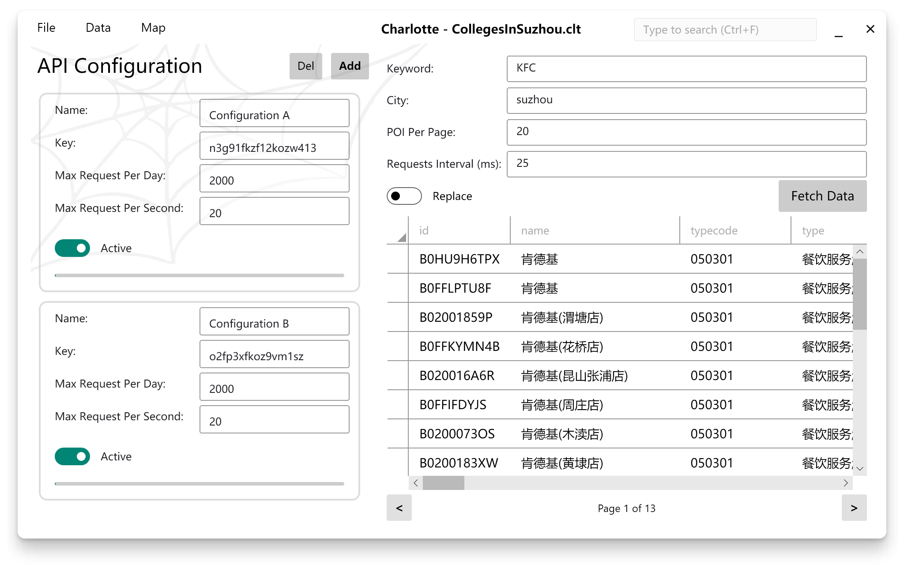

# Charlotte

*A **POI spider** as the final project for **GIS DevFdn course (2020 Fall) and GIS Software Engineering (2021 Spring)** .*

## Function

- [x] WPF-based GUI
- [x] Fetching POI data from Amap API service
- [x] Search in fetched data, with multiple keywords support
- [x] A function which allows users to save configuration as so-called "Workspace" for later use
- [x] Automatically managing usage of API keys
- [x] Export/Import to/from `.txt`, `.csv`, `.xlsx`
- [x] Workspace encryption which protects keys, fetched data, working state, etc.
- [x] Implementation of ArcEngine for simple geoprocessing tasks

